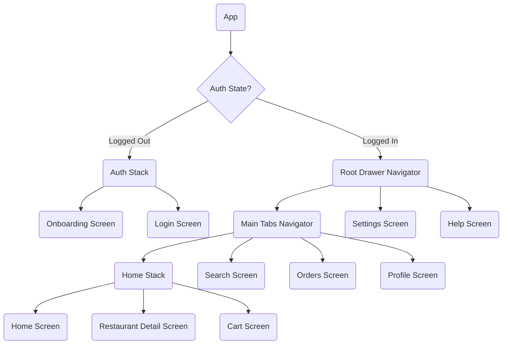
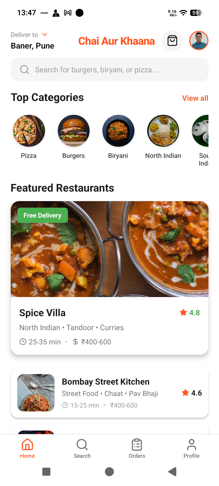
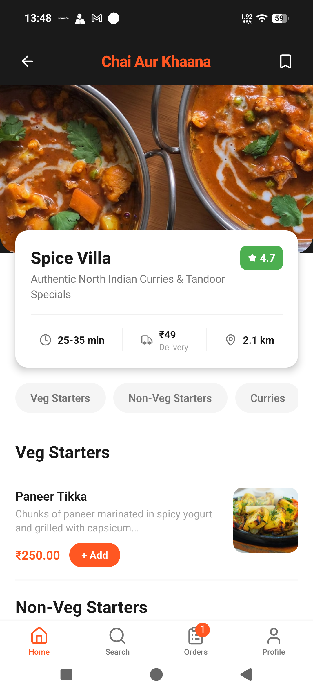
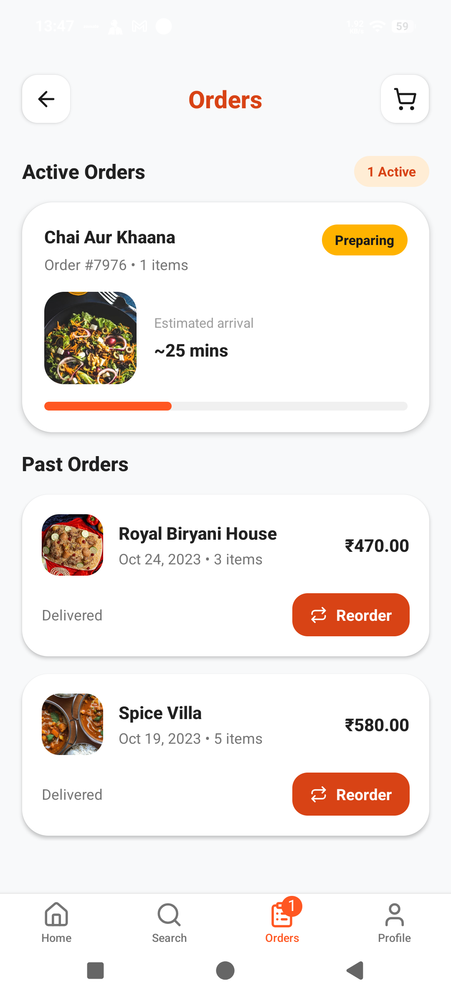
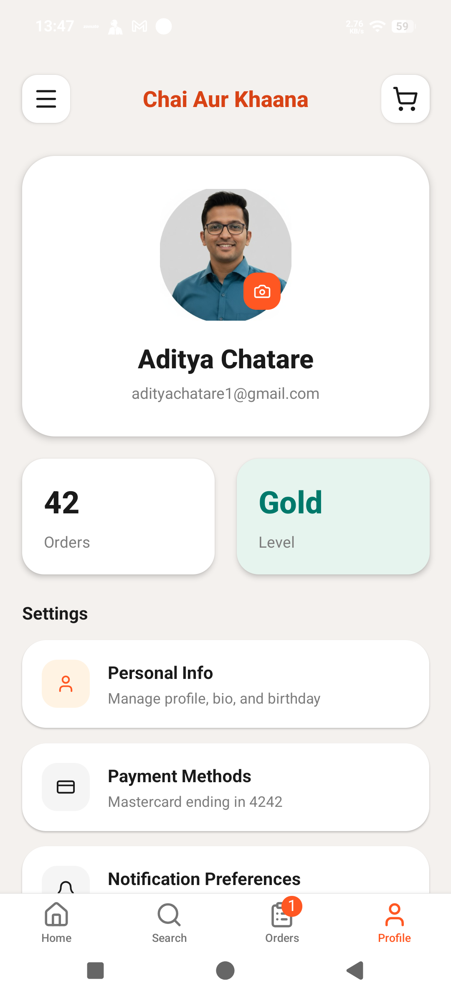
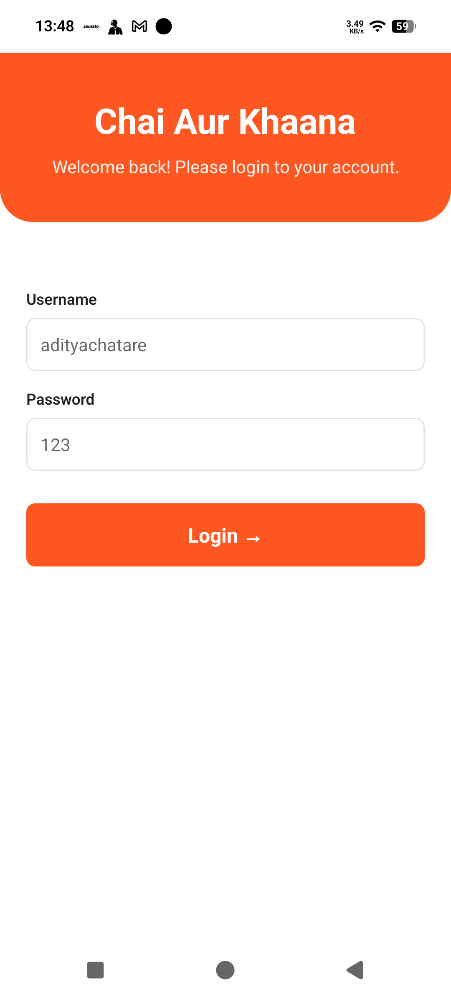
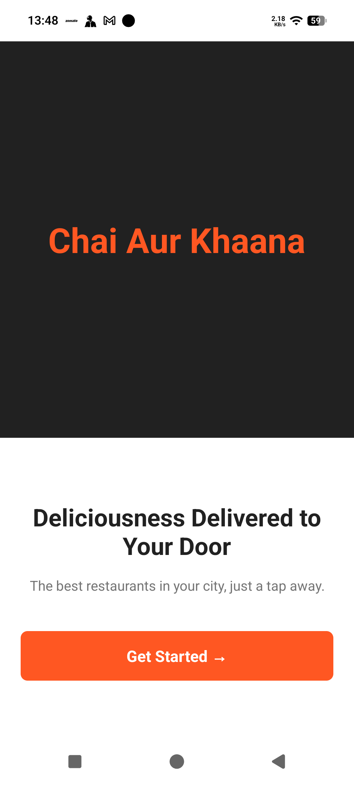
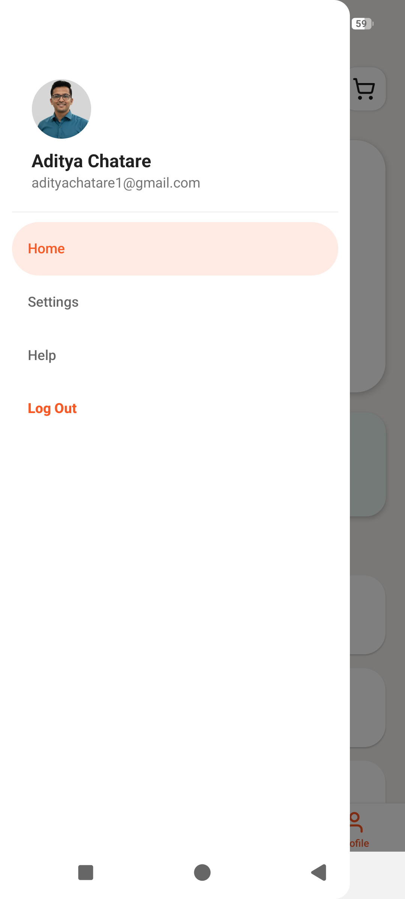

# Chai Aur Khaana

Chai Aur Khaana is a React Native food delivery app UI built with Expo. It demonstrates a full mobile navigation structure (Drawer → Tabs → Stack), protected routes, cart & orders flow, and deep linking into restaurant detail screens.

---

## Project overview

- Mobile UI for discovering restaurants, viewing menus, adding items to cart, and placing orders.
- Simple onboarding and credential-based login (demo credentials: `adityachatare` / `123`).
- Placing an order moves it to the Active Orders list and updates the Orders tab badge.

## Tech stack

- React Native (managed Expo project)
- react-navigation (Drawer, Bottom Tabs, Native Stack)
- TypeScript (project uses .tsx files)
- AsyncStorage for persisting auth state
- lucide-react-native for icons

## How to run locally

Prerequisites:

- Node.js (LTS)
- Yarn or npm
- Expo CLI (optional: `npm install -g expo-cli`)

Install dependencies and start the dev server:

```bash
npm install
# or: yarn

npx expo start
```

Open in Expo Go (mobile) or press `i` / `a` in the Expo CLI to open on an iOS simulator / Android emulator.

Notes for development:
- The app exposes a demo login that accepts username `adityachatare` and password `123`.
- Authentication state is persisted in AsyncStorage under the `isAuthenticated` key.

## Navigation structure

The app uses nested navigators: a `RootDrawer` with the main tabs and additional screens; `MainTabs` contains a `HomeStack` for onboarding, restaurant flows, and cart.



## Deep linking setup

Deep linking is configured in `src/navigation/index.tsx` using Expo Linking. The app supports links that open a restaurant detail directly using the restaurant name slug.

- Prefixes configured: the app uses the generated Expo URL prefix and the custom scheme `foodapp://`.
- Path used for restaurant detail: `restaurant/:restaurantName` (slugified name)

Examples:

- Open restaurant by name (space or special chars are slugified):
  - `foodapp://restaurant/Spice-Villa`
  - `foodapp://restaurant/Spice-Villa`

Testing deep links locally (Expo):

```bash
# From a machine with expo CLI running:
npx uri-scheme open "foodapp://restaurant/Spice-Villa" --android
npx uri-scheme open "foodapp://restaurant/Spice-Villa" --ios
```

Or trigger from adb (Android):

```bash
adb shell am start -a android.intent.action.VIEW -d "foodapp://restaurant/Spice-Villa"
```

## Screenshots
Below are the key screens included in this repo. Copy the attached image files into `assets/screenshots/` using the filenames below so they render in this README.

<!-- - `assets/screenshots/home.png` — Home feed (featured restaurants, categories)
- `assets/screenshots/restaurant.png` — Restaurant detail with menu
- `assets/screenshots/cart.png` — Cart and checkout footer
- `assets/screenshots/orders.png` — Orders screen (active + past orders)
- `assets/screenshots/profile.png` — Profile screen with avatar and settings
- `assets/screenshots/login.png` — Login screen (demo credentials)
- `assets/screenshots/onboarding.png` — Onboarding / Get Started
- `assets/screenshots/drawer.png` — Drawer with avatar and navigation -->

Preview (compact thumbnails):

<p>
  
  
  <!--  -->
  
</p>
<p>
  
  
  
  
</p>

Click any thumbnail to open the full-size image (rendering depends on the Markdown viewer).

## App video


<p>
  <video src="assets/video/app.mp4" width="240" controls poster="assets/screenshots/home.png" style="margin-right:8px;">
    Your browser does not support the video tag. You can open the video directly: <a href="assets/videos/app.mp4">Download app video</a>
  </video>
  <a href="assets/videos/app.mp4" style="vertical-align:middle; margin-left:8px;">Open full video</a>
</p>


## Assumptions made

- Login is demo-only (no backend). Credentials are checked client-side for `adityachatare` / `123`.
- Restaurant routing uses slugified names rather than numeric IDs for deep linking.
- Orders placed from the Cart are created locally in app state; no server persistence is implemented.
- Images are referenced from external URLs in the code. For production you may want to host or bundle them.


