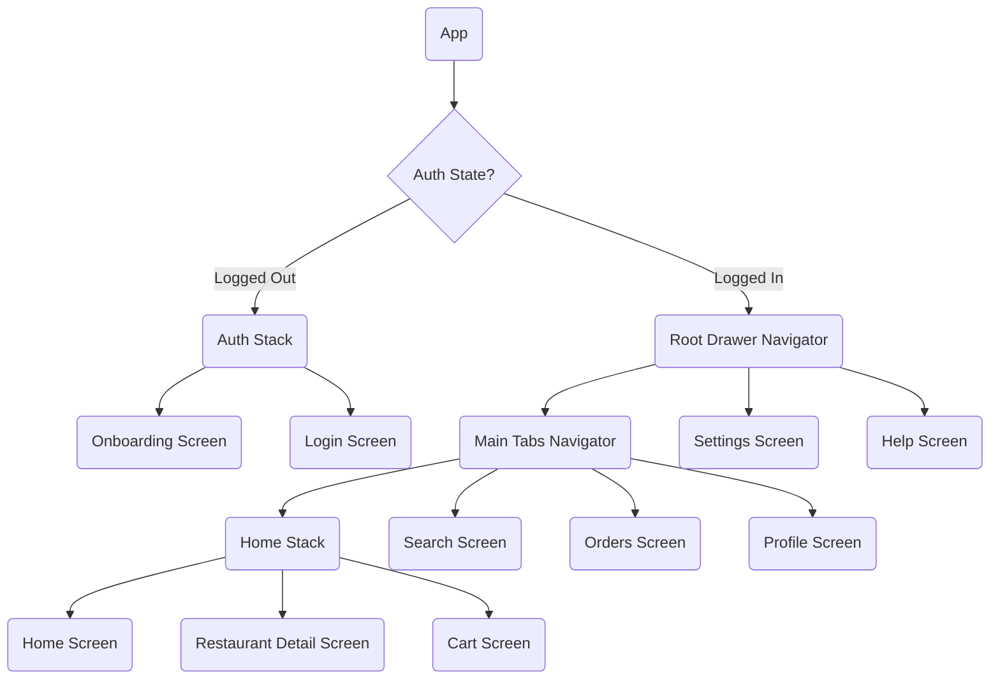

# Chai Aur Khaana

A React Native food delivery app built with Expo, featuring authentication, cart/orders management, and rich navigation.

## App Overview

`Chai Aur Khaana` is a customer-facing food ordering UI with:

* Onboarding flow and login screen
* Protected authenticated routes using `AuthContext`
* Nested drawer, bottom tabs, and stack navigation
* Restaurant detail screens with menu browsing and add-to-cart support
* Cart checkout that creates active orders
* Orders page with active and past order sections
* Orders badge on the tab bar for active order count
* Deep linking to restaurant detail via `foodapp://restaurant/<restaurantName>`

## Navigation Structure

The app uses nested React Navigation navigators for a seamless flow.



## Key Features

* **Protected Routing:** Authentication state is stored in `AuthContext` and persisted with AsyncStorage.
* **Flexible Navigation:** Drawer > Tabs > Stack nesting supports both app-wide routing and deep flows.
* **Hidden Tab Bar:** The bottom tabs are hidden automatically on `RestaurantDetail` and `Cart` screens.
* **Cart & Orders:** Users can add items to cart, place orders, and see active/past orders.
* **Orders Badge:** The `Orders` tab shows active order count in a badge.
* **Deep Linking:** Supports `foodapp://restaurant/<restaurantName>` to open a restaurant directly.

## Screens

* `OnboardingScreen` - introductory experience before login
* `LoginScreen` - credential-based login flow
* `HomeScreen` - restaurant discovery and navigation
* `RestaurantDetailScreen` - menu and cart entry for a restaurant
* `CartScreen` - checkout and place order
* `OrdersScreen` - active and past order management
* `ProfileScreen` - user profile and quick links
* `SettingsScreen` - app settings
* `HelpScreen` - support and help information

## Development

```bash
npm install
npm start
```

Open the project in Expo Go or a simulator after starting the packager.

## Notes

* The app currently uses a fixed credential login check for `adityachatare` / `123`.
* The restaurant deep link path uses the restaurant name slug.
* The bottom tabs and drawer are only available after successful login.
