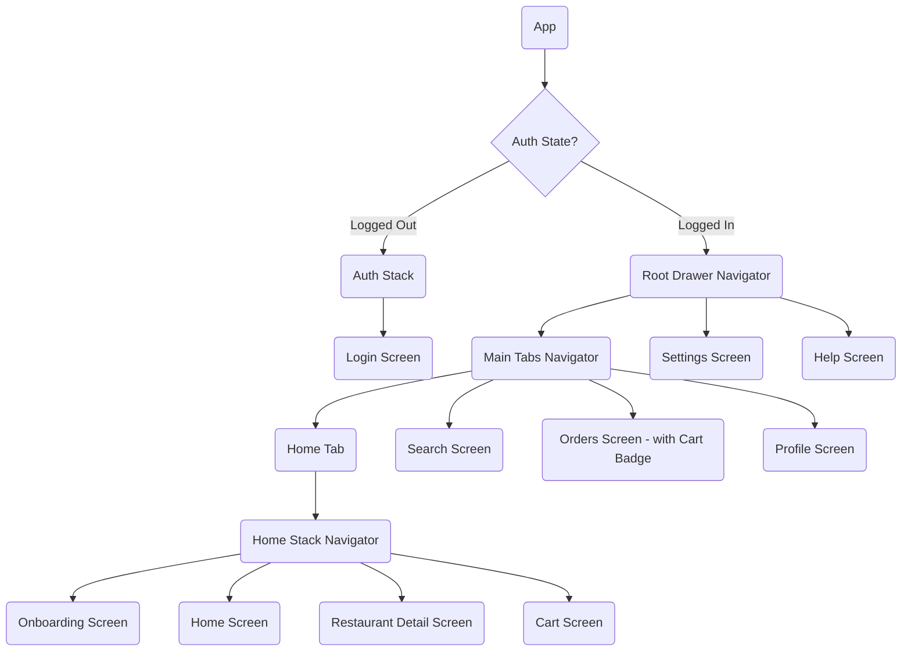

# Food Delivery App UI

A React Native food delivery app UI built with Expo, demonstrating complex React Navigation patterns.

## Navigation Structure

The app uses a combination of Stack, Bottom Tab, and Drawer navigators to handle conditional authentication and deeply nested screens.

### Key Navigation Features Implemented
*   **Conditional Auth Flow:** Uses React Context (`AuthContext`) and AsyncStorage to conditionally render either the `AuthStack` or `RootDrawer` based on authentication status.
*   **Nested Navigators:** The `HomeStack` is nested inside the `MainTabs` navigator, which is itself nested inside the `RootDrawer` navigator.
*   **Hiding Tab Bar:** The bottom tab bar is dynamically hidden on specific screens (`RestaurantDetail`, `Cart`) inside the `HomeStack` using `React.useLayoutEffect` and `getFocusedRouteNameFromRoute`.
*   **Programmatic Navigation:** Uses `navigation.navigate()`, `navigation.replace()`, and `DrawerActions.openDrawer()`.
*   **Passing Parameters:** Passes `id`, `name`, and `price` parameters from the `Home` screen to the `RestaurantDetail` screen.
*   **Deep Linking:** Configured to handle URLs like `foodapp://restaurant/123`, navigating directly into the deeply nested `RestaurantDetail` screen.
*   **Custom Drawer Content:** The drawer menu includes a custom header with user information and a custom Logout button.
